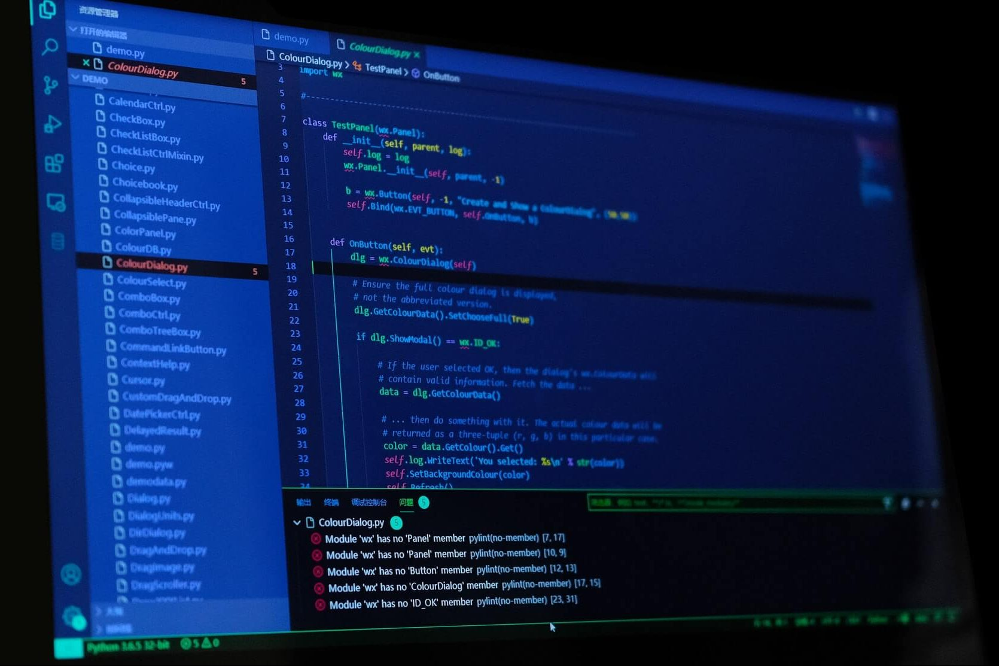
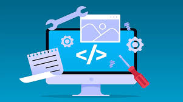

# Fases del desarrollo de software
[Video explicativo](https://www.youtube.com/watch?v=abcfxpn447w)

## 1. Análisis de requisitos

En la primera fase se estudia qué necesita el cliente o el usuario y qué debe hacer el programa. Antes de empezar a programar, hay que tener claro para qué servirá el software, qué funciones tendrá y qué condiciones debe cumplir.

### Requisitos funcionales

Son las cosas concretas que el programa debe hacer.

Por ejemplo:

* Permitir registrarse.
* Iniciar sesión.
* Guardar información.
* Buscar datos.
* Generar informes.
* Realizar una compra.

Es decir, los requisitos funcionales explican qué hace el programa.

### Requisitos no funcionales

Son las características que debe tener el programa para funcionar bien, aunque no sean funciones concretas.

Por ejemplo:

* Que sea rápido.
* Que sea seguro.
* Que sea fácil de usar.
* Que no se caiga con muchos usuarios.
* Que funcione en distintos dispositivos.

Es decir, explican cómo debe funcionar el programa.

## 2. Diseño

En esta fase se piensa cómo se va a construir el software. Es como hacer un plano antes de construir una casa.

Se decide cómo serán las pantallas, qué partes tendrá el programa, cómo se organizarán los datos, qué módulos habrá y cómo se conectarán entre sí.

## 3. Codificación y compilación

La codificación es la fase en la que los programadores escriben el código del programa usando un lenguaje de programación.

La compilación consiste en transformar ese código en un formato que el ordenador pueda entender y ejecutar. Además, ayuda a detectar errores básicos del código antes de poner el programa en marcha.

## 4. Pruebas

En esta fase se comprueba que el programa funciona correctamente. Se buscan errores para corregirlos antes de que lo usen los usuarios finales.

### Pruebas unitarias

Sirven para comprobar partes pequeñas del programa por separado.

Por ejemplo, probar que una función que suma dos números da el resultado correcto.

### Pruebas de integración

Sirven para comprobar que varias partes del programa funcionan bien juntas.

Por ejemplo, comprobar que un formulario de registro se conecta correctamente con la base de datos.

## 5. Explotación

Es la fase en la que el programa ya se pone en uso real. Es decir, se instala, se publica o se pone a disposición de los usuarios.

Por ejemplo, cuando una aplicación se sube a un servidor, una web se publica o un programa se instala en una empresa.

## 6. Mantenimiento

Cuando el software ya está en funcionamiento, puede necesitar cambios. El mantenimiento consiste en corregir errores, mejorar el programa, actualizarlo o añadir nuevas funciones.

Es una fase muy importante porque un programa casi nunca se queda igual para siempre.

7. Documentación

La documentación consiste en dejar por escrito la información importante del proyecto. Sirve para que otras personas puedan entender, usar, instalar, probar o modificar el software.

### Tipos de documentos
| Documento	| Para qué sirve |
|-----------|----------------|
| Documento de requisitos | Explica qué debe hacer el programa y qué condiciones debe cumplir. |
|Documento de diseño | Explica cómo estará organizado el software. |
| Documentación técnica | Ayuda a los programadores a entender el código y la estructura del programa. |
| Manual de usuario | Explica al usuario cómo usar el programa. |
| Manual de instalación | Indica cómo instalar y configurar el software. |
| Plan de pruebas | Explica qué pruebas se van a realizar. |
| Informe de pruebas | Recoge los errores encontrados y los resultados de las pruebas. |
| Registro de cambios | Muestra las modificaciones realizadas en cada versión. |
| Manual de mantenimiento | Explica cómo corregir, actualizar o mejorar el programa. |

Además, por cada definición, una imagen acorde con la etapa.

Inserta un video que explique las diferentes fases 